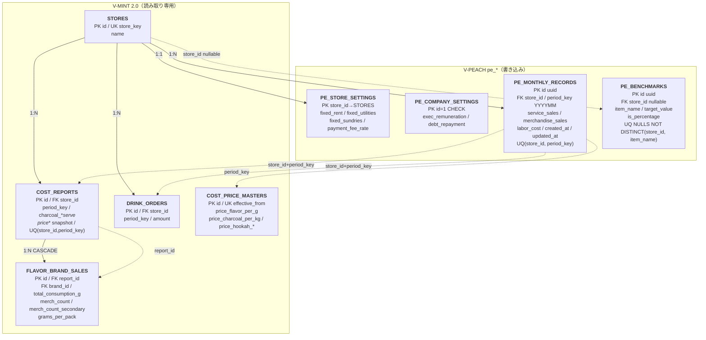

---
tags:
  - project/v-peach
  - type/note
  - type/diagram
parent:
  - - V-PEACH/notes/_index
---

# V-PEACH — Supabase ER Diagram

## Summary
- `V-PEACH` の Supabase 永続化層（`pe_*` テーブル）と、V-MINT 2.0 共用テーブルとの参照関係をまとめた ER 図。
- Supabase プロジェクトは V-MINT 2.0 と同一（`moejgsremxdksmzrowpw`）。`pe_` プレフィックスで名前空間を分離。
- 正本: [[V-PEACH/supabase/DB_MIGRATION.sql]] + [[V-PEACH/supabase/DB_MIGRATION_revision_20260517.sql]]
- V-MINT 側の詳細: [[V-MINT2.0/notes/V-MINT2.0_supabase-er-diagram]]

## テーブル一覧

### V-PEACH 所有（`pe_*`）

| テーブル名 | 区分 | 追加タイミング | 説明 |
|---|---|---|---|
| `pe_store_settings` | マスタ | Phase 1 | 店舗別固定費・決済手数料率（改定履歴なし・フォールバック用） |
| `pe_company_settings` | マスタ | Phase 1 | 全社共通費（シングルトン `id=1`・フォールバック用） |
| `pe_monthly_records` | トランザクション | Phase 1 | 月次実績（提供/物販売上・人件費） |
| `pe_benchmarks` | マスタ | Phase 1 | Health Check 目標値（旧方式・フォールバック用） |
| `pe_store_settings_revisions` | マスタ | Phase 5+ | 店舗別固定費の改定履歴（`effective_from` ベース） |
| `pe_company_settings_revisions` | マスタ | Phase 5+ | 全社共通費の改定履歴（`effective_from` ベース） |
| `pe_benchmarks_revisions` | マスタ | Phase 5+ | ベンチマーク目標値の改定履歴（4指標を1行で管理） |

### 廃止済み（Phase 5 で削除）

| テーブル名 | 廃止理由 |
|---|---|
| `pe_merchandise_price_masters` | 物販売上を月次直接入力に変更 |
| `pe_merchandise_sales_view` | 物販数量の View 集計が不要に |

### V-MINT 2.0 参照（読み取り専用・`src/api.js`）

| テーブル名 | 用途 |
|---|---|
| `stores` | 店舗 ID 解決（`store_key` ↔ UI キー） |
| `cost_reports` | 炭消費・月次原価報告ヘッダ |
| `flavor_brand_sales` | ブランド別消費 g・物販数（提供フレーバー原価算出） |
| `drink_orders` | ジュース発注額（ジュース原価） |
| `cost_price_masters` | フレーバー・炭の単価（`effective_from` で期間解決） |

> PL の物販フレーバー原価（`merchandise_sales × 89%`）と決済手数料（売上連動）は **DB ではなく `finance.js` で計算**。家賃・光熱・雑費は `pe_store_settings` からフロントで結合。

## Mermaid ER

`pe_*`（経営ダッシュボード）と V-MINT 参照（在庫・原価）を上下 2 段で表現。破線はアプリ層での論理参照（FK なし）。

## テーブル詳細 Notes

### pe_store_settings（店舗別固定費）
- `store_id` が PK かつ `stores.id` への FK。1 店舗 1 行。
- `payment_fee_rate` は UI では % 入力（例: 2.5）、DB は小数（例: 0.025）。PL では `totalSalesAfterTax × rate` で決済手数料を算出。
- Phase 5 で `fixed_payment_fee`（固定額）と `physical_profit_margin` を削除。決済手数料は売上連動、物販原価は 89% 固定計算に移行。

### pe_company_settings（全社共通費）
- `id = 1` のみ許可（`CHECK` 制約）。初期行はマイグレーションで `INSERT ... ON CONFLICT DO NOTHING`。
- `exec_remuneration`（役員報酬）・`debt_repayment`（借入返済）は **全店舗合計 PL** のみ表示。店舗別 PL には按分しない設計。

### pe_monthly_records（月次実績）
- `period_key` は `YYYYMM` 整数（例: `202605`）。
- 手入力は **3 項目のみ**: `service_sales`（必須）, `merchandise_sales`（任意・空欄=0）, `labor_cost`（必須）。
- Phase 5 で `total_sales` → `service_sales` リネーム、`merchandise_sales` 追加。`rent` / `payment_fee` / `utilities` / `sundries` は削除（設定値・計算値へ移行）。
- upsert キー: `(store_id, period_key)`。

### pe_benchmarks（目標値・旧方式）
- `store_id IS NULL` は全社共通ベンチマーク（Health Check 用）。
- `item_name` の想定値: `labor_rate` / `gross_profit_margin` / `operating_profit_margin` / `cost_ratio`。
- `target_value` は小数（例: 0.75 = 75%）。設定 UI から `/100` して保存。
- 現在は `pe_benchmarks_revisions` が主系。`pe_benchmarks` はフォールバック用。

### pe_store_settings_revisions / pe_company_settings_revisions / pe_benchmarks_revisions（改定履歴・主系）
- Phase 5+ で追加。設定値を `effective_from`（YYYYMM 整数）付きで複数バージョン管理する。
- PL 計算時は `getActiveStoreSettings` / `getActiveCompanySettings` / `getActiveBenchmarks` が `effective_from <= periodKey` の最新行を取得し、行がなければ旧テーブルにフォールバック。
- `pe_benchmarks_revisions` は4指標（`labor_rate` / `gross_profit_margin` / `operating_profit_margin` / `cost_ratio`）を1行にフラット管理。`pe_benchmarks` の item_name 1行ごと方式とは異なる。
- 設定 UI では「現在適用中」（最新行）と「改定履歴」（過去行一覧）を別段表示。現在適用中は2件以上ある場合のみ削除可能。

### V-MINT 参照の結合（アプリ層）

`src/api.js` → `src/utils/finance.js` の流れ:

| 関数 | 参照テーブル | 用途 |
|---|---|---|
| `getStoreIdByKey` | `stores` | UI キー `baba` → DB `baba_main` 正規化 |
| `getCostReportForPE` | `cost_reports`, `flavor_brand_sales`, `drink_orders` | 変動費 3 項目の算出素材 |
| `getCostPriceForPeriod` | `cost_price_masters` | `effective_from <= period_key` の最新単価 |
| `calcVariableCostFromCostReport` | —（フロント計算） | 提供 g・炭 kg・ドリンク合計から原価円換算 |
| `calcPL` | `pe_*` + 上記結果 | 税込売上・消費税・粗利・販管費・営業利益・純現金収支 |

## Views

| ビュー名 | 状態 | 説明 |
|---|---|---|
| `pe_merchandise_sales_view` | **廃止**（Phase 5） | 旧: `flavor_brand_sales` から物販数量を集計。物販売上の直接入力に置き換え |

V-PEACH 専用の DB View は現時点なし。集計・3 ヶ月平均・年次はすべてフロント（`finance.js` / `PLApp.vue`）で実施。

## Client API（`src/api.js`）

V-PEACH は Supabase RPC を使わず、anon キーからテーブル CRUD + V-MINT 読み取りのみ。

| 関数 | 対象テーブル | 用途 |
|---|---|---|
| `getStores` | `stores` | 店舗一覧 |
| `getMonthlyRecord` / `upsertMonthlyRecord` / `getMonthlyRecordsForYear` | `pe_monthly_records` | 月次 CRUD・年次一括取得 |
| `getStoreSettings` / `upsertStoreSettings` | `pe_store_settings` | 店舗固定費（フォールバック用） |
| `getActiveStoreSettings` | `pe_store_settings_revisions` → `pe_store_settings` | 期間に有効な店舗固定費（主系） |
| `getStoreSettingsRevisions` / `addStoreSettingsRevision` / `deleteStoreSettingsRevision` | `pe_store_settings_revisions` | 改定履歴 CRUD |
| `getCompanySettings` / `upsertCompanySettings` | `pe_company_settings` | 全社共通費（フォールバック用） |
| `getActiveCompanySettings` | `pe_company_settings_revisions` → `pe_company_settings` | 期間に有効な全社共通費（主系） |
| `getCompanySettingsRevisions` / `addCompanySettingsRevision` / `deleteCompanySettingsRevision` | `pe_company_settings_revisions` | 改定履歴 CRUD |
| `getBenchmarks` / `upsertBenchmark` / `deleteBenchmark` | `pe_benchmarks` | ベンチマーク（旧方式） |
| `getActiveBenchmarks` | `pe_benchmarks_revisions` | 期間に有効なベンチマーク（主系） |
| `getBenchmarksRevisions` / `addBenchmarksRevision` / `deleteBenchmarksRevision` | `pe_benchmarks_revisions` | 改定履歴 CRUD |
| `getCostReportForPE` | `cost_reports`, `flavor_brand_sales`, `drink_orders` | PL 変動費（読み取り） |
| `getCostReportDates` | `cost_reports` | V-MINT 集計期間（start_date/end_date）取得 |
| `getCostPriceForPeriod` | `cost_price_masters` | 単価解決（読み取り） |

## store_key 対応（UI ↔ DB）

| V-PEACH UI `key` | DB `stores.store_key` | 備考 |
|---|---|---|
| `baba` | `baba_main` | `api.js` の `normalizeStoreKey` で変換 |
| `nakano` | `nakano` | |
| `baba_2nd` | `baba_2nd` | |

## Migration 履歴

| ファイル | 内容 |
|---|---|
| `supabase/DB_MIGRATION.sql` | Phase 1: `pe_store_settings` / `pe_company_settings` / `pe_monthly_records` / `pe_benchmarks` 作成。旧 `pe_merchandise_price_masters` と `pe_merchandise_sales_view` も含む（後続で廃止） |
| `supabase/DB_MIGRATION_revision_20260517.sql` | Phase 5: 売上分離・月次経費カラム削除・`payment_fee_rate` 追加・物販マスタ/View 削除 |
| `supabase/DB_MIGRATION_versioned_settings.sql` | Phase 5+: `pe_store_settings_revisions` / `pe_company_settings_revisions` / `pe_benchmarks_revisions` 追加。既存設定を `effective_from=202501` で移行 |
| `supabase/DB_MIGRATION_enable_rls_20260517.sql` | Phase 5+: 全 `pe_*` テーブルで RLS を有効化（anon 全許可ポリシー） |
| `supabase/SEED_store_settings_defaults.sql` | フォールバック用デフォルト値投入（`pe_store_settings_revisions` 未適用期間の 0 落ち防止） |

## Related
- [[V-PEACH/notes/V-PEACH_architecture]]
- [[V-PEACH/notes/V-PEACH_finance-spec]]
- [[V-PEACH/notes/V-PEACH_test-plan]]
- [[V-MINT2.0/notes/V-MINT2.0_supabase-er-diagram]]
- [[V-PEACH/CHANGELOG_DEV]]
