---
tags:
  - project/v-peach
  - type/note
  - type/diagram
parent:
  - - V-PEACH/notes/_index
---

# V-PEACH — Supabase ER Diagram

## Summary
- `V-PEACH` の Supabase 永続化層（`pe_*` テーブル）と、V-MINT 2.0 共用テーブルとの参照関係をまとめた ER 図。
- Supabase プロジェクトは V-MINT 2.0 と同一（`moejgsremxdksmzrowpw`）。`pe_` プレフィックスで名前空間を分離。
- 正本: [[V-PEACH/supabase/DB_MIGRATION.sql]] ほか各マイグレーションファイル（下記 Migration 履歴参照）
- V-MINT 側の詳細: [[V-MINT2.0/notes/V-MINT2.0_supabase-er-diagram]]

## テーブル一覧

### V-PEACH 所有（`pe_*`）

| テーブル名 | 区分 | 追加タイミング | 説明 |
|---|---|---|---|
| `pe_store_settings` | マスタ（フォールバック） | Phase 1 | 店舗別固定費・決済手数料率・固定給合計（改定履歴なし・旧系フォールバック用） |
| `pe_company_settings` | マスタ（フォールバック） | Phase 1 | 全社共通費・社長代替時給（シングルトン `id=1`・旧系フォールバック用） |
| `pe_benchmarks` | マスタ（フォールバック） | Phase 1 / Phase 6 再設計 | Health Check 目標値・5指標フラット（シングルトン `id=1`・旧系フォールバック用） |
| `pe_store_settings_revisions` | マスタ（主系） | Phase 5 | 店舗別固定費の改定履歴（`effective_from` ベース） |
| `pe_company_settings_revisions` | マスタ（主系） | Phase 5 | 全社共通費の改定履歴（`effective_from` ベース） |
| `pe_benchmarks_revisions` | マスタ（主系） | Phase 5 / Phase 6 拡張 | ベンチマーク目標値の改定履歴（5指標 FLR+2 を1行で管理） |
| `pe_monthly_records` | トランザクション | Phase 1 / 複数回改修 | 月次実績（提供/物販売上・シフト枠数4列・レガシー人件費） |
| `pe_monthly_company_records` | トランザクション | Phase 8（2026-05-20） | 全社月次変動人件費総額（`total_variable_payroll`）。`period_key` PK |
| `pe_daily_sales_cache` | キャッシュ | Phase 7-2（2026-05-18） | Airレジ日別売上（店舗×日付。事業月度計算で前月最終盤を保持） |
| `pe_hrmos_staffs` | マスタ | Phase 10（2026-05-25） | HRMOS スタッフマスタ（社員ID PK・display_name・role: fixed_salary/part_time/owner_ryo） |
| `pe_hrmos_segments` | マスタ | Phase 10（2026-05-25） | HRMOS 勤務区分マスタ（勤務区分ID PK・store_id・shift_type・default_hours・is_payroll_target） |
| `pe_jp_holidays` | キャッシュ | Phase 10（2026-05-25） | 日本国民の祝日キャッシュ（holiday_date PK）。holidays-jp API から取得 |
| `pe_jp_holidays_meta` | メタ | Phase 10（2026-05-25） | 祝日 API 取得状況（シングルトン `id=1`：last_fetched_at / last_fetch_status / last_fetch_error） |
| `pe_store_shift_rules` | マスタ（改定履歴） | マルチストア P1（2026-06-11） | 店舗別シフト枠時間。店舗 × shift_type × day_type × `effective_from`（YYYYMM）で 6.0/7.5h を世代管理。P3（2026-06-11）で `shiftImporter.js` のハードコードを撤廃しこのテーブル参照に置換済み |
| `app_ui_settings` | UI 状態（共有・中立） | マルチストア P1（2026-06-11） | 両アプリ共有 UI 状態シングルトン（`id=1`・`show_inactive_stores`）。V-MINT も読み書きするため `pe_` なしの中立名前空間。P5（2026-06-12）で両アプリの「休止店舗も表示」トグルが連動済み |
| `pe_approval_items` | マスタ | 認可状況モード（2026-06-15） | 財務省認可済みパイプたばこ銘柄（brand・product_name・package_size・origin_country・approval_date・current_price）。`UNIQUE(brand,product_name,package_size)`。CSV 初期投入 5526 行 |
| `pe_approval_price_history` | トランザクション | 認可状況モード（2026-06-15） | 認可銘柄の価格変更履歴（`item_id` FK・changed_on・price_before・price_after・source: csv_seed/pdf_new/pdf_change）。初期投入 1659 行 |

### 廃止済み（Phase 5 で削除）

| テーブル名 | 廃止理由 |
|---|---|
| `pe_merchandise_price_masters` | 物販売上を月次直接入力に変更 |
| `pe_merchandise_sales_view` | 物販数量の View 集計が不要に |

### V-MINT 2.0 参照（読み取り専用・`src/api.js`）

| テーブル名 | 用途 |
|---|---|
| `stores` | 店舗 ID 解決（`store_key` ↔ UI キー）。マルチストア P1（2026-06-11）で `is_active` / `display_order` / `store_type` / `closed_at` を追加 |
| `cost_reports` | 炭消費・月次原価報告ヘッダ |
| `flavor_brand_sales` | ブランド別消費 g・物販数（提供フレーバー原価算出） |
| `drink_orders` | ジュース発注額（ジュース原価） |
| `cost_price_masters` | フレーバー・炭の単価（`effective_from` で期間解決） |

> PL の物販フレーバー原価（`merchandise_sales × 89%`）と決済手数料（売上連動）は **DB ではなく `finance.js` で計算**。家賃・光熱・雑費は `pe_store_settings_revisions` → `pe_store_settings` フォールバックでフロントに結合。

## Mermaid ER

6 つのグループに分類。実線は DB FK、破線はアプリ層での論理参照（FK なし）。

```mermaid
flowchart TD
    subgraph PEACH_FB["V-PEACH マスタ（フォールバック用・旧系）"]
        PE_STORE["`**PE_STORE_SETTINGS**
        PK store_id→STORES
        fixed_rent / fixed_utilities
        fixed_sundries / payment_fee_rate
        fixed_salary_total`"]

        PE_COMPANY["`**PE_COMPANY_SETTINGS**
        PK id=1 CHECK
        exec_remuneration / debt_repayment
        ryo_hourly_rate`"]

        PE_BENCH["`**PE_BENCHMARKS**
        PK id=1 CHECK（フラット）
        f_ratio / l_ratio / r_ratio
        operating_profit_margin / labor_rate`"]
    end

    subgraph PEACH_REV["V-PEACH マスタ（改定履歴・主系）"]
        PE_STORE_REV["`**PE_STORE_SETTINGS_REVISIONS**
        PK id bigserial
        FK store_id / UK effective_from YYYYMM
        fixed_rent / fixed_utilities
        fixed_sundries / payment_fee_rate
        fixed_salary_total / note
        UQ(store_id, effective_from)`"]

        PE_COMPANY_REV["`**PE_COMPANY_SETTINGS_REVISIONS**
        PK id bigserial
        UK effective_from YYYYMM
        exec_remuneration / debt_repayment
        ryo_hourly_rate / note`"]

        PE_BENCH_REV["`**PE_BENCHMARKS_REVISIONS**
        PK id bigserial
        UK effective_from YYYYMM
        f_ratio / l_ratio / r_ratio
        operating_profit_margin / labor_rate / note`"]

        PE_SHIFT_RULES["`**PE_STORE_SHIFT_RULES**
        PK id bigserial
        FK store_id / effective_from YYYYMM
        shift_type early・middle・late
        day_type weekday・holiday
        hours 6.0 or 7.5 / note
        UQ(store_id,effective_from,shift_type,day_type)`"]
    end

    subgraph PEACH_TXN["V-PEACH トランザクション（月次）"]
        PE_MONTHLY["`**PE_MONTHLY_RECORDS**
        PK id uuid
        FK store_id / period_key YYYYMM
        service_sales / merchandise_sales
        part_time_slots_6h / part_time_slots_7_5h
        ryo_slots_6h / ryo_slots_7_5h
        UQ(store_id, period_key)`"]

        PE_MONTHLY_CO["`**PE_MONTHLY_COMPANY_RECORDS**
        PK period_key YYYYMM
        total_variable_payroll`"]
    end

    subgraph PEACH_CACHE["V-PEACH キャッシュ"]
        PE_DAILY["`**PE_DAILY_SALES_CACHE**
        PK id uuid
        FK store_id / sale_date date
        discount_amount / gross_sales
        customer_count / raw_payload jsonb
        UQ(store_id, sale_date)`"]
    end

    subgraph SHARED_UI["共有 UI 状態（中立・両アプリ）"]
        APP_UI["`**APP_UI_SETTINGS**
        PK id=1 CHECK
        show_inactive_stores`"]
    end

    subgraph HRMOS_MASTER["HRMOS マスタ・祝日"]
        PE_STAFFS["`**PE_HRMOS_STAFFS**
        PK hrmos_staff_id int
        display_name / account_name
        role: fixed_salary/part_time/owner_ryo
        FK default_store_id（任意）
        joined_on / left_on`"]

        PE_SEGMENTS["`**PE_HRMOS_SEGMENTS**
        PK hrmos_segment_id int
        segment_name
        FK store_id（任意）
        shift_type: early/middle/late/allin/misc
        default_hours / is_payroll_target`"]

        PE_HOLIDAYS["`**PE_JP_HOLIDAYS**
        PK holiday_date date
        holiday_name`"]

        PE_HOLIDAYS_META["`**PE_JP_HOLIDAYS_META**
        PK id=1 CHECK
        last_fetched_at / last_fetch_status
        last_fetch_error`"]
    end

    subgraph VMINT["V-MINT 2.0（読み取り専用）"]
        STORES["`**STORES**
        PK id / UK store_key
        name / is_active / display_order
        store_type shop・office / closed_at`"]

        COST_REPORTS["`**COST_REPORTS**
        PK id / FK store_id
        period_key / charcoal_*_serve
        UQ(store_id,period_key)`"]

        FLAVOR["`**FLAVOR_BRAND_SALES**
        PK id / FK report_id
        FK brand_id
        total_consumption_g
        merch_count / merch_count_secondary`"]

        DRINK_ORDERS["`**DRINK_ORDERS**
        PK id / FK store_id
        period_key / amount`"]

        COST_PRICE["`**COST_PRICE_MASTERS**
        PK id / UK effective_from
        price_flavor_per_g
        price_charcoal_per_kg`"]
    end

    STORES -->|1:1 FK| PE_STORE
    STORES -->|1:N FK| PE_STORE_REV
    STORES -->|1:N FK| PE_MONTHLY
    STORES -->|1:N FK| PE_DAILY
    STORES -.->|任意FK| PE_STAFFS
    STORES -.->|任意FK| PE_SEGMENTS
    STORES -->|1:N FK| PE_SHIFT_RULES

    STORES -->|1:N| COST_REPORTS
    COST_REPORTS -->|1:N CASCADE| FLAVOR
    STORES -->|1:N| DRINK_ORDERS

    PE_STORE_REV -.->|フォールバック先| PE_STORE
    PE_COMPANY_REV -.->|フォールバック先| PE_COMPANY
    PE_BENCH_REV -.->|フォールバック先| PE_BENCH

    PE_MONTHLY -.->|store_id+period_key| COST_REPORTS
    PE_MONTHLY -.->|period_key| COST_PRICE
    PE_MONTHLY -.->|store_id+period_key| DRINK_ORDERS
    PE_MONTHLY -.->|period_key| PE_MONTHLY_CO

    PE_HOLIDAYS_META -.->|管理| PE_HOLIDAYS
```



## テーブル詳細 Notes

### pe_store_settings（店舗別固定費・フォールバック）
- `store_id` が PK かつ `stores.id` への FK。1 店舗 1 行。
- `payment_fee_rate` は UI では % 入力（例: 2.5）、DB は小数（例: 0.025）。PL では `totalSalesAfterTax × rate` で決済手数料を算出。
- `fixed_salary_total`（2026-05-20 追加）: 固定給スタッフの月次合計。`pe_store_settings_revisions` に有効行がある場合はそちらを優先。
- Phase 5 で `fixed_payment_fee`（固定額）と `physical_profit_margin` を削除。

### pe_company_settings（全社共通費・フォールバック）
- `id = 1` のみ許可（`CHECK` 制約）。シングルトン。
- `exec_remuneration`（役員報酬）・`debt_repayment`（借入返済）は **全店舗合計 PL** のみ表示。店舗別 PL には按分しない。
- `ryo_hourly_rate`（2026-05-20 追加）: 社長代替勤務の換算時給。シフト枠数 × 時間 × 本値で社長代替人件費を算出。

### pe_benchmarks（目標値・フォールバック）
- フラット・シングルトン形式（`id=1` 固定）。5指標：`f_ratio` / `l_ratio` / `r_ratio` / `operating_profit_margin` / `labor_rate`。
- Phase 6（2026-05-18）で旧 EAV 形式（`item_name` / `target_value` / `is_percentage`）からフラット形式に再設計。
- 現在は `pe_benchmarks_revisions` が主系。`pe_benchmarks` は `effective_from` 以前の旧月用フォールバック。

### pe_store_settings_revisions / pe_company_settings_revisions / pe_benchmarks_revisions（改定履歴・主系）
- Phase 5 で追加。設定値を `effective_from`（YYYYMM 整数）付きで複数バージョン管理する。
- PL 計算時は `getActiveStoreSettings` / `getActiveCompanySettings` / `getActiveBenchmarks` が `effective_from <= periodKey` の最新行を取得し、行がなければ旧テーブルにフォールバック。
- `pe_benchmarks_revisions` は 2026-05-18 に `gross_profit_margin` / `cost_ratio` を除外し FLR 比 3 列を追加。
- `pe_store_settings_revisions` は 2026-05-20 に `fixed_salary_total` 列を追加。`pe_company_settings_revisions` は同日 `ryo_hourly_rate` 列を追加。
- 設定 UI では「現在適用中」（最新行）と「改定履歴」（過去行一覧）を別段表示。

### pe_monthly_records（月次実績）
- `period_key` は `YYYYMM` 整数（例: `202605`）。upsert キー: `(store_id, period_key)`。
- **人件費新方式（2026-05-20 以降）**: `part_time_slots_6h` / `part_time_slots_7_5h` / `ryo_slots_6h` / `ryo_slots_7_5h` の4列が主体。フロントが `pe_monthly_company_records.total_variable_payroll` × 各店舗枠数比率で変動人件費を按分。
- `labor_cost` カラムは 2026-05-29 に DROP。新方式（枠数按分）のみ有効。
- Phase 5 で `total_sales` → `service_sales` リネーム、`merchandise_sales` 追加。`rent` / `payment_fee` / `utilities` / `sundries` は削除（設定値・計算値へ移行）。

### pe_monthly_company_records（全社月次変動人件費・Phase 8 / 2026-05-20 追加）
- `period_key` PK（YYYYMM）。この行の存在が「新方式で計算可能か」の判定キー。
- `total_variable_payroll`：当月の全店バイト給与＋交通費の総額。店舗ごとの加重枠数比率で按分して各店舗の変動人件費を算出。

### pe_daily_sales_cache（Airレジ日別売上キャッシュ・Phase 7-2）
- `(store_id, sale_date)` が UK。事業月度計算（前月後半〜当月前半）のため前月分も保持。
- `discount_amount`: Airレジの割引額（正値）。事業月度売上から差し引き。
- `gross_sales` / `customer_count` / `raw_payload`: 監査・デバッグ用（任意列）。
- 不要な古い行は `deleteOldDailySalesCache` で削除。常時 90 行前後に収まる設計。

### pe_hrmos_staffs（HRMOS スタッフマスタ・2026-05-25 追加）
- `hrmos_staff_id`（整数）が PK。HRMOS CSV の社員 ID をそのまま使用。
- `role`: `fixed_salary`（固定給）/ `part_time`（バイト）/ `owner_ryo`（社長代替）の3区分。CSV 取込時は自動判定不可なケースがあり UI で手動上書き可能。
- `default_store_id`: 参考用（シフト枠按分は `pe_hrmos_segments.store_id` を優先）。

### pe_hrmos_segments（HRMOS 勤務区分マスタ・2026-05-25 追加）
- `hrmos_segment_id`（整数）が PK。HRMOS CSV の勤務区分 ID をそのまま使用。
- `shift_type`: `early`（早番 7.5h）/ `middle`（中番 6h）/ `late`（遅番 6h）/ `allin`（通し 11.5h）/ `misc`（特殊・按分対象外）。※早番・中番の時間表記は `default_hours` 実データ準拠に 2026-06-11 訂正（旧表記は逆だった）
- `is_payroll_target = false` の行（倉庫・会議・特殊枠）は変動人件費按分から除外。
- `store_id` が NULL の区分は全店またがる特殊枠として扱う。

### pe_jp_holidays / pe_jp_holidays_meta（祝日キャッシュ・2026-05-25 追加）
- `pe_jp_holidays`: holidays-jp API から取得した祝日を `holiday_date` PK でキャッシュ。
- `pe_jp_holidays_meta`: シングルトン（`id=1`）。最終取得日時・ステータスを管理。UI の「祝日更新」ボタンが叩くエンドポイントで更新。

### pe_store_shift_rules（店舗別シフト枠時間・マルチストア P1 / 2026-06-11 追加）
- 店舗 × シフト種別（early/middle/late）× 日種別（weekday=平日 / holiday=土日祝）× `effective_from`（YYYYMM）で枠時間（6.0 / 7.5）を世代管理。`effective_from <= periodKey` の最新世代を採用（`getActiveStoreSettings` と同方式）。
- 初期世代（`effective_from=202512`）は現行実装の再現: **早番7.5h / 中番6h / 遅番6h、馬場2号店のみ遅番×土日祝=7.5h**（`applyBaba2ndLateHolidayBoost` 相当）。3 店舗 × 6 パターン = 18 行。
- P3（2026-06-11）で `shiftImporter.js` のハードコード（`STORE_KEYS` 固定・馬場2号店遅番補正）を撤廃しこのテーブル参照へ置換済み。`api.js` の `getStoreShiftRules()`（stores と FK join で store_key 解決・全世代返却）で取得し、世代選択（`effective_from<=periodKey` の最新）と枠時間ルックアップは shiftImporter 内の純関数で実施。InputApp が CSV 取込時に取得して引数で渡す。

### app_ui_settings（両アプリ共有 UI 状態・マルチストア P1 / 2026-06-11 追加）
- シングルトン（`id=1` CHECK）。`show_inactive_stores`: 「休止店舗も表示」トグルの全社一括状態（R3）。
- V-MINT も読み書きするため `pe_` プレフィックスなしの中立名前空間。P5（2026-06-12）で両アプリのトグル（V-PEACH PL セレクタ横・V-MINT ダッシュボード）がこの 1 行に連動済み（楽観更新＋失敗ロールバック）。V-MINT 側トグルは休止店舗が存在するときのみ出現。

### V-MINT 参照の結合（アプリ層）

`src/api.js` → `src/utils/finance.js` の流れ:

| 関数 | 参照テーブル | 用途 |
|---|---|---|
| `getStoreIdByKey` | `stores` | UI キー `baba` → DB `baba_main` 正規化 |
| `getCostReportForPE` | `cost_reports`, `flavor_brand_sales`, `drink_orders` | 変動費 3 項目の算出素材 |
| `getCostPriceForPeriod` | `cost_price_masters` | `effective_from <= period_key` の最新単価 |
| `calcVariableCostFromCostReport` | —（フロント計算） | 提供 g・炭 kg・ドリンク合計から原価円換算 |
| `calcPL` | `pe_*` + 上記結果 | 税込売上・消費税・粗利・販管費・営業利益・純現金収支 |

## Views

| ビュー名 | 状態 | 説明 |
|---|---|---|
| `pe_merchandise_sales_view` | **廃止**（Phase 5） | 旧: `flavor_brand_sales` から物販数量を集計。物販売上の直接入力に置き換え |

V-PEACH 専用の DB View は現時点なし。集計・3 ヶ月平均・年次はすべてフロント（`finance.js` / `PLApp.vue`）で実施。

## Client API（`src/api.js`）

V-PEACH は原則テーブル CRUD のみだが、マルチストア P4（2026-06-11）で初の RPC `create_store_atomic` を追加した。

**RPC: `create_store_atomic(p_store_key, p_name, p_effective_from, p_settings jsonb, p_shift_rules jsonb)`**（P4 / migration `multi_store_p4_create_store_atomic`）
- 新店舗追加ウィザード（一発確定）のサーバ側トランザクション。`stores`＋`pe_store_settings`（現行値）＋`pe_store_settings_revisions`（初期世代）＋`pe_store_shift_rules`（6行）を一括 insert し、失敗時は全体ロールバック（半端な店舗を作らない）。
- サーバ側バリデーション: `store_key` 正規表現（`^[a-z][a-z0-9_]{1,29}$`・重複拒否）／固定費5項目必須／シフトルール early・middle・late × weekday・holiday の6パターン必須。`display_order` は既存最大+1 を自動採番、`store_type='shop'` 固定。
- SQL: `supabase/DB_MIGRATION_multi_store_p4_create_store_atomic_20260611.sql`

| 関数 | 対象テーブル | 用途 |
|---|---|---|
| `getStores` | `stores` | 店舗一覧 |
| `getMonthlyRecord` / `upsertMonthlyRecord` / `getMonthlyRecordsForYear` | `pe_monthly_records` | 月次 CRUD・年次一括取得 |
| `getStoreSettings` / `upsertStoreSettings` | `pe_store_settings` | 店舗固定費（フォールバック用） |
| `getActiveStoreSettings` | `pe_store_settings_revisions` → `pe_store_settings` | 期間に有効な店舗固定費（主系） |
| `getStoreSettingsRevisions` / `addStoreSettingsRevision` / `deleteStoreSettingsRevision` | `pe_store_settings_revisions` | 改定履歴 CRUD |
| `getCompanySettings` / `upsertCompanySettings` | `pe_company_settings` | 全社共通費（フォールバック用） |
| `getActiveCompanySettings` | `pe_company_settings_revisions` → `pe_company_settings` | 期間に有効な全社共通費（主系） |
| `getCompanySettingsRevisions` / `addCompanySettingsRevision` / `deleteCompanySettingsRevision` | `pe_company_settings_revisions` | 改定履歴 CRUD |
| `getBenchmarks` / `upsertBenchmark` | `pe_benchmarks` | ベンチマーク（旧方式・フォールバック） |
| `getActiveBenchmarks` | `pe_benchmarks_revisions` | 期間に有効なベンチマーク（主系） |
| `getBenchmarksRevisions` / `addBenchmarksRevision` / `deleteBenchmarksRevision` | `pe_benchmarks_revisions` | 改定履歴 CRUD |
| `getCostReportForPE` | `cost_reports`, `flavor_brand_sales`, `drink_orders` | PL 変動費（読み取り） |
| `getCostReportDates` | `cost_reports` | V-MINT 集計期間（start_date/end_date）取得 |
| `getCostPriceForPeriod` | `cost_price_masters` | 単価解決（読み取り） |
| `getMonthlyCompanyRecord(periodKey)` | `pe_monthly_company_records` | 全社月次変動人件費（新方式判定・取得） |
| `upsertMonthlyCompanyRecord(periodKey, payload)` | `pe_monthly_company_records` | 同上 upsert |
| `getMonthlyCompanyRecordsForYear(year)` | `pe_monthly_company_records` | 年次一括取得（N+1削減用） |
| `getDailySalesInRange(storeId, startDate, endDate)` | `pe_daily_sales_cache` | 日次売上キャッシュ範囲取得（事業月度計算用） |
| `upsertDailySalesCache(rows)` | `pe_daily_sales_cache` | 日次売上キャッシュ upsert |
| `deleteOldDailySalesCache(storeId, beforeDate)` | `pe_daily_sales_cache` | 古いキャッシュ削除（start_date より前） |
| `getHrmosStaffs` / `upsertHrmosStaffs` / `updateHrmosStaffRole` | `pe_hrmos_staffs` | HRMOS スタッフマスタ CRUD（CSV 取込時バルク upsert・ロール手動上書き） |
| `getHrmosSegments` / `upsertHrmosSegments` / `updateHrmosSegment` | `pe_hrmos_segments` | HRMOS 勤務区分マスタ CRUD（自動判定不可レコードの手動上書き対応） |
| `getJpHolidays(yearOrRange)` / `upsertJpHolidays(rows)` | `pe_jp_holidays` | 祝日キャッシュ参照・バルク upsert |
| `getJpHolidaysMeta` / `updateJpHolidaysMeta` | `pe_jp_holidays_meta` | 祝日 API 最終取得状況の参照・更新 |
| `getApprovalBrands` | `pe_approval_items`（RPC `get_approval_brands`） | distinct ブランド一覧（昇順） |
| `getApprovalItems({ brand, search, sortKey, sortDir, limit })` | `pe_approval_items` | 認可銘柄の検索・絞り込み取得（`.range()` 分割取得で PostgREST 1000行上限を回避） |
| `getApprovalPriceHistory(itemId)` | `pe_approval_price_history` | 銘柄の価格変更履歴（新→旧順） |
| `insertApprovalItems(rows)` | `pe_approval_items` | 新規認可銘柄の一括 INSERT（ブランド正規化あり） |
| `applyApprovalChanges(changes)` | `pe_approval_items` + `pe_approval_price_history` | 変更認可: 現行価格更新＋履歴追加 |
| `callParseApprovalPdf(pdfBase64, kind)` | Edge Function `parse-approval-pdf` | 財務省 PDF → Gemini 構造化抽出 |

## store_key 対応（UI ↔ DB）

| V-PEACH UI `key` | DB `stores.store_key` | 備考 |
|---|---|---|
| `baba` | `baba_main` | `api.js` の `normalizeStoreKey` で変換 |
| `nakano` | `nakano` | |
| `baba_2nd` | `baba_2nd` | |

## Row Level Security（RLS）

全 `pe_*` テーブルおよび `app_ui_settings` に RLS 有効化（anon 全許可ポリシー）。URL 非公開・信頼ユーザー前提の内部ツール。

```sql
-- 全テーブル共通ポリシー
ALLOW ALL TO anon USING (true) WITH CHECK (true);
```

## Migration 履歴

| ファイル | 内容 |
|---|---|
| `supabase/DB_MIGRATION.sql` | Phase 1: `pe_store_settings` / `pe_company_settings` / `pe_monthly_records` / `pe_benchmarks` 作成。旧 `pe_merchandise_price_masters` と `pe_merchandise_sales_view` も含む（後続で廃止） |
| `supabase/DB_MIGRATION_revision_20260517.sql` | Phase 5: 売上分離・月次経費カラム削除・`payment_fee_rate` 追加・物販マスタ/View 削除 |
| `supabase/DB_MIGRATION_versioned_settings.sql` | Phase 5: `pe_store_settings_revisions` / `pe_company_settings_revisions` / `pe_benchmarks_revisions` 追加。既存設定を `effective_from=202501` で移行 |
| `supabase/DB_MIGRATION_enable_rls_20260517.sql` | Phase 5: 全 `pe_*` テーブルで RLS を有効化（anon 全許可ポリシー） |
| `supabase/DB_MIGRATION_benchmarks_flr_20260518.sql` | Phase 6: `pe_benchmarks_revisions` に `f_ratio` / `l_ratio` / `r_ratio` を追加 |
| `supabase/DB_MIGRATION_benchmarks_restructure_20260518.sql` | Phase 6: `pe_benchmarks` を旧 EAV 形式からフラット・シングルトン形式に再設計 |
| `supabase/DB_MIGRATION_daily_sales_cache_20260518.sql` | Phase 7-2: `pe_daily_sales_cache` 作成 |
| `supabase/DB_MIGRATION_labor_cost_20260520.sql` | Phase 8: `pe_monthly_records` に枠数4列追加・`pe_monthly_company_records` 新設・`pe_store_settings` に `fixed_salary_total` 追加・`pe_company_settings` と両 revisions に `ryo_hourly_rate` 追加 |
| `supabase/DB_MIGRATION_hrmos_masters_20260525.sql` | Phase 10: `pe_hrmos_staffs` / `pe_hrmos_segments` / `pe_jp_holidays` / `pe_jp_holidays_meta` を新規作成、RLS 有効化 |
| `supabase/SEED_store_settings_defaults.sql` | フォールバック用デフォルト値投入（`pe_store_settings_revisions` 未適用期間の 0 落ち防止） |
| `supabase/SEED_benchmarks_defaults_20260518.sql` | Phase 6: ベンチマーク 5 指標の初期値投入（`pe_benchmarks` シングルトン） |
| `supabase/SEED_daily_sales_cache_202512.sql` | Phase 7-2: 2025年12月分 Airレジ日次キャッシュ初回投入（3店舗 × 25日 = 75行） |
| `supabase/DB_MIGRATION_multi_store_p1_20260611.sql` | マルチストア P1: `stores` に `is_active`/`display_order`/`store_type`/`closed_at` 追加、`pe_store_shift_rules`・`app_ui_settings` 新設＋RLS＋SEED。Supabase MCP で 2026-06-11 適用済み |
| `supabase/DB_MIGRATION_multi_store_p4_create_store_atomic_20260611.sql` | マルチストア P4: `create_store_atomic` RPC 新設（新店舗追加ウィザードのサーバ側トランザクション）。Supabase MCP で 2026-06-11 適用済み。※行ベース新 RPC `*_v2`（P2）は V-MINT2.0 側 `supabase/rpc_v2.sql` で管理 |
| `supabase/DB_MIGRATION_approval_status_20260615.sql` | 認可状況モード: `pe_approval_items`・`pe_approval_price_history` 新設＋RLS＋`get_approval_brands` RPC。2026-06-15 適用 |

## Related
- [[V-PEACH/notes/V-PEACH_architecture]]
- [[V-PEACH/notes/V-PEACH_finance-spec]]
- [[V-PEACH_test-plan]]
- [[V-MINT2.0/notes/V-MINT2.0_supabase-er-diagram]]
- [[V-PEACH/CHANGELOG_DEV]]
