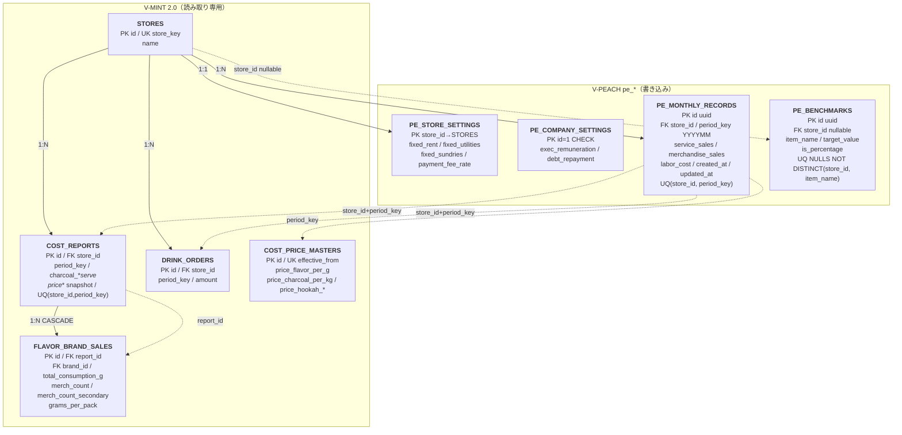

---
tags:
  - project/v-peach
  - type/note
  - type/diagram
parent:
  - - V-PEACH/notes/_index
---

# V-PEACH — Supabase ER Diagram

## Summary
- `V-PEACH` の Supabase 永続化層（`pe_*` テーブル）と、V-MINT 2.0 共用テーブルとの参照関係をまとめた ER 図。
- Supabase プロジェクトは V-MINT 2.0 と同一（`moejgsremxdksmzrowpw`）。`pe_` プレフィックスで名前空間を分離。
- 正本: [[V-PEACH/supabase/DB_MIGRATION.sql]] + [[V-PEACH/supabase/DB_MIGRATION_revision_20260517.sql]]
- V-MINT 側の詳細: [[V-MINT2.0/notes/V-MINT2.0_supabase-er-diagram]]

## テーブル一覧

### V-PEACH 所有（`pe_*`）

| テーブル名 | 区分 | 追加タイミング | 説明 |
|---|---|---|---|
| `pe_store_settings` | マスタ | Phase 1 | 店舗別固定費・決済手数料率・固定給月報酬（改定履歴なし・フォールバック用） |
| `pe_company_settings` | マスタ | Phase 1 | 全社共通費・社長代替時給（シングルトン `id=1`・フォールバック用） |
| `pe_monthly_records` | トランザクション | Phase 1 | 月次実績（提供/物販売上・レガシー人件費・バイト/社長枠数） |
| `pe_monthly_company_records` | トランザクション | 人件費新方式（2026-05-20） | 全社月次変動人件費総額（`total_variable_payroll`）。`period_key` PK |
| `pe_daily_sales_cache` | キャッシュ | Phase 7-2 | Airレジ日別売上（店舗×日付。事業月度計算で前月最終盤を保持） |
| `pe_benchmarks` | マスタ | Phase 1 | Health Check 目標値（フラット・シングルトン `id=1`・フォールバック用） |
| `pe_store_settings_revisions` | マスタ | Phase 5+ | 店舗別固定費の改定履歴（`effective_from` ベース） |
| `pe_company_settings_revisions` | マスタ | Phase 5+ | 全社共通費の改定履歴（`effective_from` ベース） |
| `pe_benchmarks_revisions` | マスタ | Phase 5+ | ベンチマーク目標値の改定履歴（5指標を1行で管理） |
| `pe_hrmos_staffs` | マスタ | HRMOS 取込（2026-05-25） | HRMOS スタッフマスタ（社員ID PK・display_name・role: fixed_salary/part_time/owner_ryo） |
| `pe_hrmos_segments` | マスタ | HRMOS 取込（2026-05-25） | HRMOS 勤務区分マスタ（勤務区分ID PK・store_id・shift_type: early/middle/late/allin/misc・default_hours・is_payroll_target） |
| `pe_jp_holidays` | キャッシュ | HRMOS 取込（2026-05-25） | 日本国民の祝日キャッシュ（holiday_date PK）。holidays-jp API から取得 |
| `pe_jp_holidays_meta` | メタ | HRMOS 取込（2026-05-25） | 祝日 API 取得状況（シングルトン `id=1`：last_fetched_at / last_fetch_status / last_fetch_error） |

### 廃止済み（Phase 5 で削除）

| テーブル名 | 廃止理由 |
|---|---|
| `pe_merchandise_price_masters` | 物販売上を月次直接入力に変更 |
| `pe_merchandise_sales_view` | 物販数量の View 集計が不要に |

### V-MINT 2.0 参照（読み取り専用・`src/api.js`）

| テーブル名 | 用途 |
|---|---|
| `stores` | 店舗 ID 解決（`store_key` ↔ UI キー） |
| `cost_reports` | 炭消費・月次原価報告ヘッダ |
| `flavor_brand_sales` | ブランド別消費 g・物販数（提供フレーバー原価算出） |
| `drink_orders` | ジュース発注額（ジュース原価） |
| `cost_price_masters` | フレーバー・炭の単価（`effective_from` で期間解決） |

> PL の物販フレーバー原価（`merchandise_sales × 89%`）と決済手数料（売上連動）は **DB ではなく `finance.js` で計算**。家賃・光熱・雑費は `pe_store_settings` からフロントで結合。

## Mermaid ER

`pe_*`（経営ダッシュボード）と V-MINT 参照（在庫・原価）を上下 2 段で表現。破線はアプリ層での論理参照（FK なし）。

## テーブル詳細 Notes

### pe_store_settings（店舗別固定費）
- `store_id` が PK かつ `stores.id` への FK。1 店舗 1 行。
- `payment_fee_rate` は UI では % 入力（例: 2.5）、DB は小数（例: 0.025）。PL では `totalSalesAfterTax × rate` で決済手数料を算出。
- Phase 5 で `fixed_payment_fee`（固定額）と `physical_profit_margin` を削除。決済手数料は売上連動、物販原価は 89% 固定計算に移行。

### pe_company_settings（全社共通費）
- `id = 1` のみ許可（`CHECK` 制約）。初期行はマイグレーションで `INSERT ... ON CONFLICT DO NOTHING`。
- `exec_remuneration`（役員報酬）・`debt_repayment`（借入返済）は **全店舗合計 PL** のみ表示。店舗別 PL には按分しない設計。

### pe_monthly_records（月次実績）
- `period_key` は `YYYYMM` 整数（例: `202605`）。
- 人件費新方式では枠数4列（`part_time_slots_6h/7_5h`・`ryo_slots_6h/7_5h`）が主体。`labor_cost` は過去月フォールバック用。
- Phase 5 で `total_sales` → `service_sales` リネーム、`merchandise_sales` 追加。`rent` / `payment_fee` / `utilities` / `sundries` は削除（設定値・計算値へ移行）。
- upsert キー: `(store_id, period_key)`。

### pe_monthly_company_records（全社月次変動人件費・2026-05-20追加）
- `period_key` PK（YYYYMM）。この行の存在が「新方式で計算可能か」の判定キー。
- `total_variable_payroll`：当月の全店バイト給与＋交通費の総額。店舗ごとの重みつき枠数比率で按分して各店舗の変動人件費を算出。

### pe_benchmarks（目標値・フォールバック）
- フラット・シングルトン形式（`id=1` 固定）。5指標（`f_ratio` / `l_ratio` / `r_ratio` / `operating_profit_margin` / `labor_rate`）。
- 現在は `pe_benchmarks_revisions` が主系。`pe_benchmarks` は `effective_from` 以前の旧月用フォールバック。

### pe_store_settings_revisions / pe_company_settings_revisions / pe_benchmarks_revisions（改定履歴・主系）
- Phase 5+ で追加。設定値を `effective_from`（YYYYMM 整数）付きで複数バージョン管理する。
- PL 計算時は `getActiveStoreSettings` / `getActiveCompanySettings` / `getActiveBenchmarks` が `effective_from <= periodKey` の最新行を取得し、行がなければ旧テーブルにフォールバック。
- `pe_benchmarks_revisions` は **5指標**（`f_ratio` / `l_ratio` / `r_ratio` / `operating_profit_margin` / `labor_rate`）を1行にフラット管理。2026-05-18 に `gross_profit_margin` / `cost_ratio` を除外し FLR 比 3 列を追加。
- `pe_store_settings_revisions` は 2026-05-20 に `fixed_salary_total` 列を追加。`pe_company_settings_revisions` は同日 `ryo_hourly_rate` 列を追加。
- 設定 UI では「現在適用中」（最新行）と「改定履歴」（過去行一覧）を別段表示。現在適用中は2件以上ある場合のみ削除可能。

### V-MINT 参照の結合（アプリ層）

`src/api.js` → `src/utils/finance.js` の流れ:

| 関数 | 参照テーブル | 用途 |
|---|---|---|
| `getStoreIdByKey` | `stores` | UI キー `baba` → DB `baba_main` 正規化 |
| `getCostReportForPE` | `cost_reports`, `flavor_brand_sales`, `drink_orders` | 変動費 3 項目の算出素材 |
| `getCostPriceForPeriod` | `cost_price_masters` | `effective_from <= period_key` の最新単価 |
| `calcVariableCostFromCostReport` | —（フロント計算） | 提供 g・炭 kg・ドリンク合計から原価円換算 |
| `calcPL` | `pe_*` + 上記結果 | 税込売上・消費税・粗利・販管費・営業利益・純現金収支 |

## Views

| ビュー名 | 状態 | 説明 |
|---|---|---|
| `pe_merchandise_sales_view` | **廃止**（Phase 5） | 旧: `flavor_brand_sales` から物販数量を集計。物販売上の直接入力に置き換え |

V-PEACH 専用の DB View は現時点なし。集計・3 ヶ月平均・年次はすべてフロント（`finance.js` / `PLApp.vue`）で実施。

## Client API（`src/api.js`）

V-PEACH は Supabase RPC を使わず、anon キーからテーブル CRUD + V-MINT 読み取りのみ。

| 関数 | 対象テーブル | 用途 |
|---|---|---|
| `getStores` | `stores` | 店舗一覧 |
| `getMonthlyRecord` / `upsertMonthlyRecord` / `getMonthlyRecordsForYear` | `pe_monthly_records` | 月次 CRUD・年次一括取得 |
| `getStoreSettings` / `upsertStoreSettings` | `pe_store_settings` | 店舗固定費（フォールバック用） |
| `getActiveStoreSettings` | `pe_store_settings_revisions` → `pe_store_settings` | 期間に有効な店舗固定費（主系） |
| `getStoreSettingsRevisions` / `addStoreSettingsRevision` / `deleteStoreSettingsRevision` | `pe_store_settings_revisions` | 改定履歴 CRUD |
| `getCompanySettings` / `upsertCompanySettings` | `pe_company_settings` | 全社共通費（フォールバック用） |
| `getActiveCompanySettings` | `pe_company_settings_revisions` → `pe_company_settings` | 期間に有効な全社共通費（主系） |
| `getCompanySettingsRevisions` / `addCompanySettingsRevision` / `deleteCompanySettingsRevision` | `pe_company_settings_revisions` | 改定履歴 CRUD |
| `getBenchmarks` / `upsertBenchmark` / `deleteBenchmark` | `pe_benchmarks` | ベンチマーク（旧方式） |
| `getActiveBenchmarks` | `pe_benchmarks_revisions` | 期間に有効なベンチマーク（主系） |
| `getBenchmarksRevisions` / `addBenchmarksRevision` / `deleteBenchmarksRevision` | `pe_benchmarks_revisions` | 改定履歴 CRUD |
| `getCostReportForPE` | `cost_reports`, `flavor_brand_sales`, `drink_orders` | PL 変動費（読み取り） |
| `getCostReportDates` | `cost_reports` | V-MINT 集計期間（start_date/end_date）取得 |
| `getCostPriceForPeriod` | `cost_price_masters` | 単価解決（読み取り） |
| `getMonthlyCompanyRecord(periodKey)` | `pe_monthly_company_records` | 全社月次変動人件費（新方式判定・取得） |
| `upsertMonthlyCompanyRecord(periodKey, payload)` | `pe_monthly_company_records` | 同上 upsert |
| `getMonthlyCompanyRecordsForYear(year)` | `pe_monthly_company_records` | 年次一括取得（N+1削減用） |
| `getDailySalesInRange(storeId, startDate, endDate)` | `pe_daily_sales_cache` | 日次売上キャッシュ範囲取得（事業月度計算用） |
| `upsertDailySalesCache(rows)` | `pe_daily_sales_cache` | 日次売上キャッシュ upsert |
| `deleteOldDailySalesCache(storeId, beforeDate)` | `pe_daily_sales_cache` | 古いキャッシュ削除（start_date より前） |
| `getHrmosStaffs / upsertHrmosStaffs / updateHrmosStaffRole` | `pe_hrmos_staffs` | HRMOS スタッフマスタ CRUD（CSV取込時バルク upsert・ロール手動上書き） |
| `getHrmosSegments / upsertHrmosSegments / updateHrmosSegment` | `pe_hrmos_segments` | HRMOS 勤務区分マスタ CRUD（自動判定不可レコードの手動上書き対応） |
| `getJpHolidays(yearOrRange) / upsertJpHolidays(rows)` | `pe_jp_holidays` | 祝日キャッシュ参照・バルク upsert |
| `getJpHolidaysMeta / updateJpHolidaysMeta` | `pe_jp_holidays_meta` | 祝日 API 最終取得状況の参照・更新 |

## store_key 対応（UI ↔ DB）

| V-PEACH UI `key` | DB `stores.store_key` | 備考 |
|---|---|---|
| `baba` | `baba_main` | `api.js` の `normalizeStoreKey` で変換 |
| `nakano` | `nakano` | |
| `baba_2nd` | `baba_2nd` | |

## Migration 履歴

| ファイル | 内容 |
|---|---|
| `supabase/DB_MIGRATION.sql` | Phase 1: `pe_store_settings` / `pe_company_settings` / `pe_monthly_records` / `pe_benchmarks` 作成。旧 `pe_merchandise_price_masters` と `pe_merchandise_sales_view` も含む（後続で廃止） |
| `supabase/DB_MIGRATION_revision_20260517.sql` | Phase 5: 売上分離・月次経費カラム削除・`payment_fee_rate` 追加・物販マスタ/View 削除 |
| `supabase/DB_MIGRATION_versioned_settings.sql` | Phase 5+: `pe_store_settings_revisions` / `pe_company_settings_revisions` / `pe_benchmarks_revisions` 追加。既存設定を `effective_from=202501` で移行 |
| `supabase/DB_MIGRATION_enable_rls_20260517.sql` | Phase 5+: 全 `pe_*` テーブルで RLS を有効化（anon 全許可ポリシー） |
| `supabase/DB_MIGRATION_benchmarks_flr_20260518.sql` | Phase 7: `pe_benchmarks_revisions` に `f_ratio` / `l_ratio` / `r_ratio` を追加 |
| `supabase/DB_MIGRATION_benchmarks_restructure_20260518.sql` | Phase 7: `pe_benchmarks` をフラット・シングルトン形式に再設計 |
| `supabase/DB_MIGRATION_daily_sales_cache_20260518.sql` | Phase 7-2: `pe_daily_sales_cache` 作成 |
| `supabase/DB_MIGRATION_labor_cost_20260520.sql` | 人件費新方式: `pe_monthly_records` に枠数4列追加・`pe_monthly_company_records` 新設・`pe_store_settings` に `fixed_salary_total` 追加・`pe_company_settings` に `ryo_hourly_rate` 追加 |
| `supabase/DB_MIGRATION_hrmos_masters_20260525.sql` | HRMOS シフト CSV 取込基盤: `pe_hrmos_staffs` / `pe_hrmos_segments` / `pe_jp_holidays` / `pe_jp_holidays_meta` を新規作成、RLS 有効化 |
| `supabase/SEED_store_settings_defaults.sql` | フォールバック用デフォルト値投入（`pe_store_settings_revisions` 未適用期間の 0 落ち防止） |
| `supabase/SEED_benchmarks_defaults_20260518.sql` | ベンチマーク 5 指標の初期値投入（`pe_benchmarks` シングルトン） |
| `supabase/SEED_daily_sales_cache_202512.sql` | Phase 7-2: 2025年12月分 Airレジ日次キャッシュ初回投入（3店舗 × 25日 = 75行） |

## Related
- [[V-PEACH/notes/V-PEACH_architecture]]
- [[V-PEACH/notes/V-PEACH_finance-spec]]
- [[V-PEACH/notes/V-PEACH_test-plan]]
- [[V-MINT2.0/notes/V-MINT2.0_supabase-er-diagram]]
- [[V-PEACH/CHANGELOG_DEV]]
